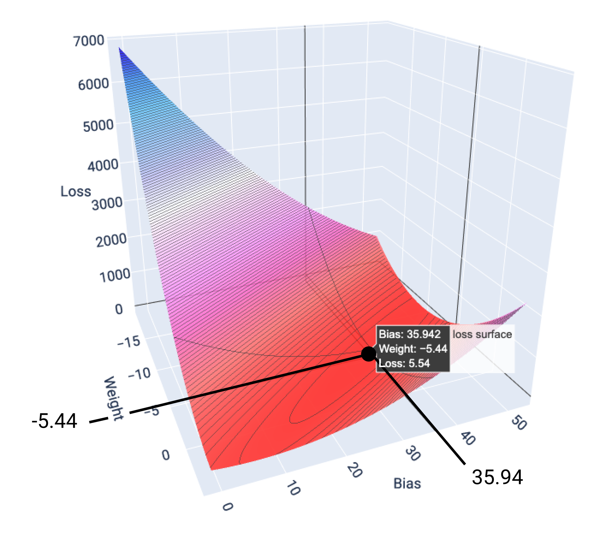

The process of updating the weights and bias in order to get a better prediction

"
The model begins training with randomized weights and biases near zero, and then repeats the following steps:

1. Calculate the loss with the current weight and bias.
    
2. Determine the direction to move the weights and bias that reduce loss.
    
3. Move the weight and bias values a small amount in the direction that reduces loss.
    
4. Return to step one and repeat the process until the model can't reduce the loss any further.
"

**Linear Models** -> **Convex Surface**

The point of lowest loss could be visualized by this function, as the lowest loss would be the lowest point in the graph.
It shows the lowest loss as a point in the graph defined by the others factors.

This is the **reason** linear convergence works as it is. 
Because it tries to find the point where the slope of weight and bias is zero.

It **tends** to find the minimal point. Which means, it will normally be extremely close to it, but almost never will find it (GER).