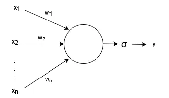
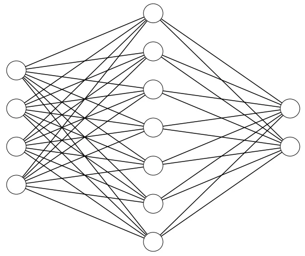

### McCulloch-Pitts Neuron (MP) 
$$y = 
\begin{cases} 
1, & \text{ if } \sum_{i=1}^{n} x_i \geq b, \\
0, & \text{otherwise.}
\end{cases}$$
### Perceptron
- Differences -> Values $x_i$ are multiplied by weights $w_i$
$$
y = 
\begin{cases} 
1, & \text{ if } \sum_{i=1}^{n} x_i \cdot w_i \geq b, \\
0, & \text{otherwise.}
\end{cases}
$$
- If the result of the function $f(x_1, x_2, ..., x_i) = x_1.w_1 + x_2.w_2 + ... + x_i.w_i - b$ is positive, then it means $y = 1$
- Essentially, you can define $x_0 = 1$ and $w_0 = -b$ in order to allow the perceptron to find the threshold itself
- The adjustments of the weights allow it to "learn"
- In order to improve it's capabilities to learn you can attach to a non-linear function (**Activation Function**) like the example
- 

### Multi Layer Perceptron (MLP)

- Division
	- **Input** -> FIRST LAYER
		- Depends on the number of features of the problem
		- What will be analyzed
	- **Hidden Layers** -> IN-BETWEEN
		- The logic between the first and last layer of the network
	- **Output** -> LAST LAYER
		- Depends on the type of output expected
		- How many variables on the output
- All neuron on one layer is connected to all the neuron in the next layer
	- **Fully connected network**
- **Directional**: Information flows just in one direction Input -> Output
- **UNIVERSAL APPROXIMATION THEOREM**
	- Finite number of neurons within a **single** hidden layer -> **can** approximate any continuous function 
		- Activation function must be "well behaved" and non-linear
		- Subsets of Euclidean Vector Spaces -> Need to deepen into that
- Most efficiency -> Multiple layers
- 