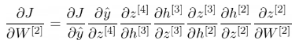

#### Use of derivatives
- ***BACK-PROPAGATION***
	- How neural networks learn
	- Adjustment of weights to minimize errors
	- How it works?
		1. Making a forward pass -> Running the model normally
			- Calculating the weighted sum at each neuron
				- $sum = inputs \cdot weights + bias$
				- After that, apply the activation function
		2. Calculating error
			- By applying an function to calculate the error
			- loss functions -> mean squared error for regression or cross-entropy for classification
		3. Propagating the error backward -> **USING DERIVATIVES**
			1. **Derivative of the loss** -> takes into account the weight defined
				- Tells how much the weight contributed to the error
			2. Calculate the error from the output layer -> Apply the **chain rule** (calculus) -> Follow up to the neuron behind the analyzed layer
			3. Update the weight -> Slight modification towards the value that is thought is correct
				- This is done estimating the lesser error got from the weight
				- The size of the adjustment is the **learning rate**
			- 

# Activation functions
### Sigmoid
$y = \frac{1}{1 + e^{-x}}$
- Output between 0 and 1
- $S(x) = y = \frac{1}{1 + e^{-x}}$ -> $S'(x) = S(x)(1 - S(x))$
	- If close to 0 -> 0 . (Something) = 0
	- If close to 1 -> 1 . (1 - 1) = 1 . 0 = 0
- Should not be used in hidden layers
	- As the layers go on and on, values that are closer to 0 and 1 on $x$
	- When on back-propagation, as the derivative of the function is used to update the weights, it might make everything go unnoticeable, as the derivative tends to 0
	- Products of two terms that go near 0 tends to 0

### Hyperbolic tangent
$y = \frac{e^x - e^{-x}}{e^x + e^{-x}}$
- Output between -1 and 1
- Related to the sigmoid function
	- Showing the association $$\frac{e^x - e^{-x}}{e^x + e^{-x}} = \frac{e^x}{e^x + e^{-x}} - \frac{e^{-x}}{e^x + e^{-x}} = \frac{e^{-x}}{e^{-x}} \frac{e^x}{e^x + e^{-x}} - \frac{e^x}{e^x}\frac{e^{-x}}{e^x + e^{-x}} = \frac{1}{1 + e^{-2x}} - \frac{1}{1 + e^{2x}} = Sigmoid(2x) - Sigmoid(-2x)$$
	- So $tanh(x) = S(2x) - S(-2x)$ -> $tanh'(x) = S'(2x) - S'(-2x)$

### Softmax
$f(x) = \frac{e^{x_i}}{\sum^{n}_{k=1}{e^{x_k}}}$
- Applied inside a vector of n elements
- Normalizes the whole vector -> value between 0 and 1
- All values $x_i$ sums up to 1 -> Because of the normalization of the values
- Exaggerates differences
- Generally used on the output layer -> Predicting the probability of the output being one of the classes

### ReLU
$`f(x) = max(0, x) = \{^{0, \ if \ x \ < 0}_{x, \ if \ x \geq 0}`$
- Efficiency
- Do not show negative values

# Loss Function
- _Cost Function_
- Calculates the error of the neural network
- Types of data:
	- Train data: to evolve the network
	- Test data: to analyze current network development
- Types of errors:
	- Local error: error of **one** prediction
	- Global error: **sum** of the local errors
### Mean Absolute Error
$MAE = \frac{\sum ^{N}_{i=1} |ŷ_i - y_i|}{N}$
- N -> Number of observations in our train data

### Mean Square Error 
$MSE = \frac{\sum ^{N}_{i=1} ||ŷ_i - y_i||^2}{N}$
 - The notation || || -> Generality
	 - Goes to say, if scalar values = $(ŷ_i - y_i)²$
	 - If vector outputs = $\sum ^k _{j=1} (ŷ_{ij} - y_{ij})^2$
 - Advantages -> Intensification of differences
#### Root Mean Squared Error
- Just $\sqrt {MSE}$
- Advantages, unit preservation -> Easier to comprehend

### Cross Entropy
- Bernoulli distribution
	- Probability of two binary terms being equal to each other
	- $P(a = b) = {a}^{b}(1 - {a})^{1-b}$
		- We are seeking for a or b to be equal the result of $P(a = b)$ if there is a defined a or b
		- If b = 0
			- $P(a = 0) = a^0(1 - a)^{1-0} = 1-a$ -> We want $1 - a$ to be closer to 1
		- If b = 1
			- $P(a = 0) = a^1(1 - a)^{1-1} = a$  -> We want $a$ to be closer to 1
	- So, for $ŷ_i$ and $y_i$, to find the correct prediction, we need to find the situation as when $ŷ_i = y_i$, for this, we can use $P(ŷ_i = y_i) = {ŷ_i}^{y_i}(1 - {ŷ_i})^{1-y_i}$
- Supposing independent results, to calculate the probability of getting each answer right could be calculated with the product of the probability of each local success, with $\prod ^N _{i=1} success \ probability$, which we can get with $\prod ^N _{i=1} {ŷ_i}^{y_i}(1 - {ŷ_i})^{1-y_i}$
	- As sums are better to work with than products 
		- $\prod ^N _{i=1} {ŷ_i}^{y_i}(1 - {ŷ_i})^{1-y_i} = \sum ^N _{i=1} \log(ŷ_i) + (1-y_i)\log(1-ŷ_i)$
	
- This is the expression of cross entropy for binary elements $y$ and $ŷ$:
	- $\sum ^N _{i=1} \log(ŷ_i) + (1-y_i)\log(1-ŷ_i)$
	
- Cross entropy can be adapted to more than two classes
- #TODO Study other loss functions -> Huber loss, Kullback-Leibler Divergence, Jensen-Shannon divergence, etc

# Back-propagation
- We take the error in the **output** layer and propagate backwards
	- As talked in the beginning of this document
- In order to get to the minimal error that we can, we need to apply the derivative of our loss function with the output weights -> We only want to find how much tweaking in the output would affect our loss function
	- So, in order to find the minimal of the loss function J in a network of k layers we first calculate $\frac{\partial J}{\partial W^{[k]}}$
- By applying the chain rule and remembering that our network is built with those equities in mind
	- $z^{[k]} = W^{[k]} h^{[k - 1]} + b^{[k]}$ -> The layer weighted sum
		- Pre-activation
	- $h^{[k]} = \phi^{[k]}(z^{[k]})$ ->  The current layer input
		- The post-activation
		- $\phi^{[k]}$ would be our non-linear activation function
	- Goes from the last layer to the indicated layer
	- If there are four layers and we want to respect the $W^{[2]}$ one as reference for J, then it could be calculated by:
	-  

- The last step would be to update the weights going from the output to the first layer
	- In order to update the weight with the new value we can apply:
		- $W^{[k]} = W^{[k]} - \alpha \frac{\partial J}{\partial W^{[k]}}$ -> $\alpha$ being the learning rate 
	- Which means we find the minimum and apply the rate of the modification by using the learning rate as a multiplier for our application

# Initialization of parameters
- We can initialize with weights defined from random sampling of certain distributions
	- Normal Distribution (0, 1)
	- Uniform Distribution (-1, 1)
- We can use certain initialization methods, such as Glorot Initialization in order to get the values to be closer and more related to each other