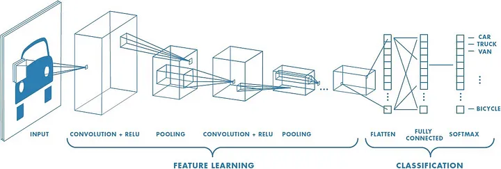

- Good for computer vision
- Representation: 
- Correlation between neighbors to detect patterns
- Association with the brain
	- Parts of the brain that are responsible for detecting simpler shapes
	- Parts of the brain that are responsible for detecting more complex shapes
- MLP -> Weights connecting the neurons to one layer from another
- CNN -> Linear operations connecting the neurons to one layer from another (**Convolution** and **Pooling**)

## Convolution
> First of all, in order to understand it better i have also used [this](https://www.youtube.com/watch?v=KuXjwB4LzSA) video from 3 blue 1 brown

- Two functions 
	- $f(x)$ -> Input
	- $g(x)$ -> Kernel
- The convolution of $f$ and $g$ would be
	- $(f \ * \ g)(x) = \int^{+\infty} _{-\infty} f(t)g(t-x) \ dt$
- $g$  would be a *"filter"* passed to the function $f$ to search for specific patterns