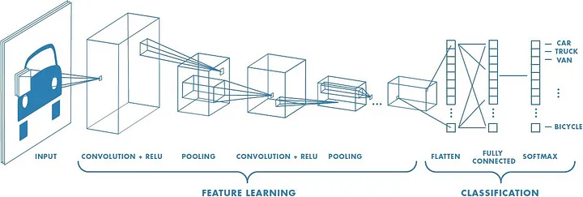
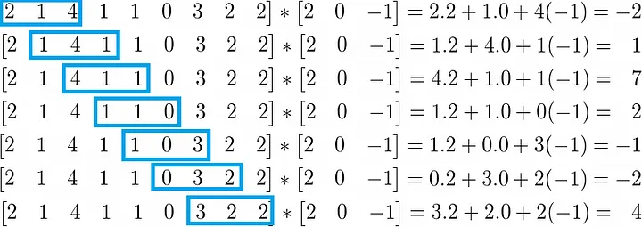

- Good for computer vision
- Representation: 
- Correlation between neighbors to detect patterns
- Association with the brain
	- Parts of the brain that are responsible for detecting simpler shapes
	- Parts of the brain that are responsible for detecting more complex shapes
- MLP -> Weights connecting the neurons to one layer from another
- CNN -> Linear operations connecting the neurons to one layer from another (**Convolution** and **Pooling**)

## Convolution
> In order to visualize it better i have also used [this](https://www.youtube.com/watch?v=KuXjwB4LzSA) video from 3 blue 1 brown

- The operation: $(f * g)$ -> $f$ convoluted in $g$ 
- Two functions 
	- $f(x)$ -> Input
	- $g(x)$ -> Kernel
- The convolution of $f$ and $g$ would be
	- $(f \ * \ g)(x) = \int^{+\infty} _{-\infty} f(t)g(t-x) \ dt$
- $g$  would be a *"filter"* passed to the function $f$ to search for specific patterns
	- It will basically gradually apply the values of $g$ in the points of $f$ domain
- Can be represented also as $(f * g)(x) = \sum ^{+\infty} _{t = -\infty} f(t)g(t - x)$
- Basically speaking you're applying the image
### One dimensional convolutions

- What you're doing is applying $g$ onto $f$ continuously, calculating the values for every iteration and that's the result of the convolution
### Two dimensional convolutions

Repeating the same process, applying $g$ on $f$, multiplying all elements of $g$ by a fitting number of elements on $f$

### Summarizing convolution
- Scanning the input data ($f$), using the kernel data ($g$) as a way to observe it
	- Looking at image ($f$) through an specific set of goggles ($g$)
For two elements
- $(I * K)(i, j) = \sum_m \sum_n I(m, n)K(i-m, j-n)$
- The $i - m$ and $j-n$ is for the flipping of the filter (kernel) $K$

### Feature map
- $Size = (n * n) * (k * k) = ((\frac {n + 2p - k} {s} + 1) \times (\frac {n + 2p - k} {s} + 1))$
- The size will be a square matrix (Of size $\frac {n + 2p - k}{s} + 1$) because of the fact that both the kernel and the original matrix are square to.
#### Increase the feature map size
In order to get more values associated with the kernel you can add padding
- Padding: matrix with zeros
- Allows to reach more values with the kernel

##### Reduce the feature map size
Stride -> The horizontal and vertical skip
- First horizontal and then vertical
- Higher values makes it do greater skips

Size -> Bigger kernel size -> More points that does not get accessed 

### Three dimensional convolution
- $I = n \times n \times t$ and $K = m \times m \times t$ -> $O$ of two dimensions
	- But in general $O = \sum_k O_k$

# Pooling
- Basically goes around the matrix of values and takes the maximum or the average of the values inside the grid of the kernel
